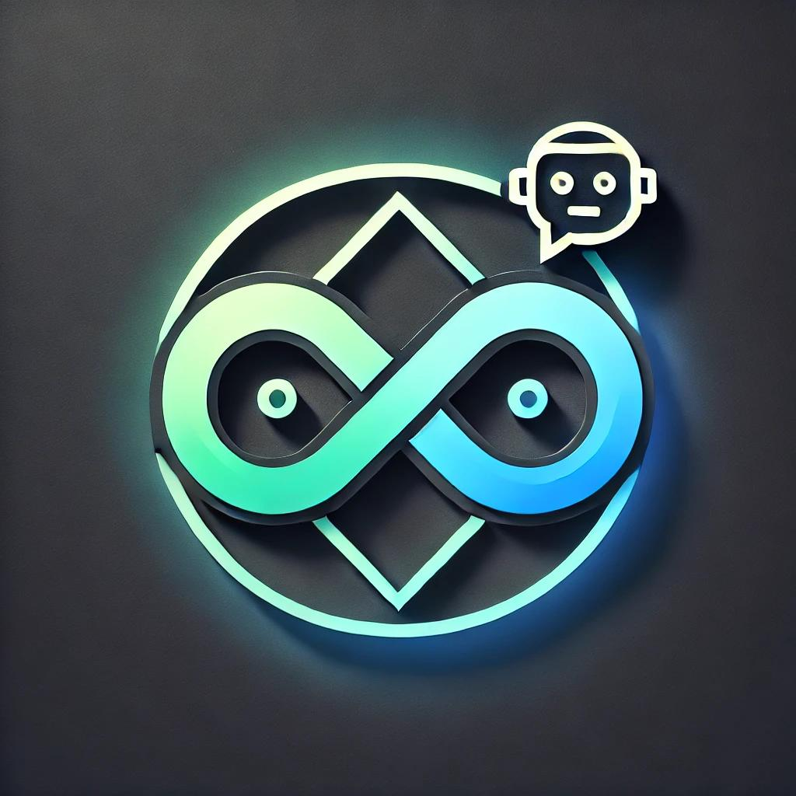
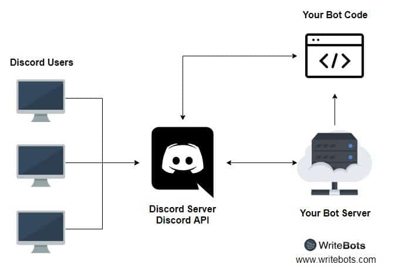
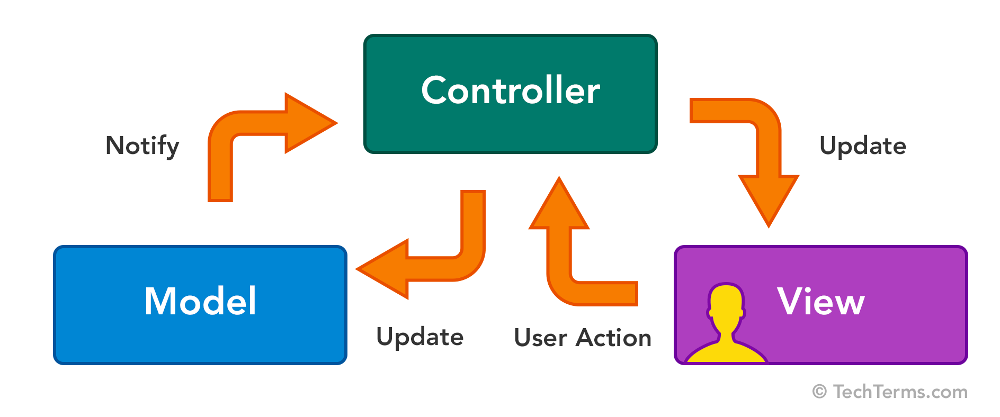
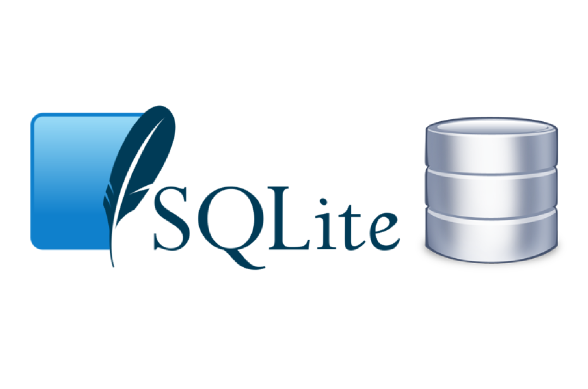
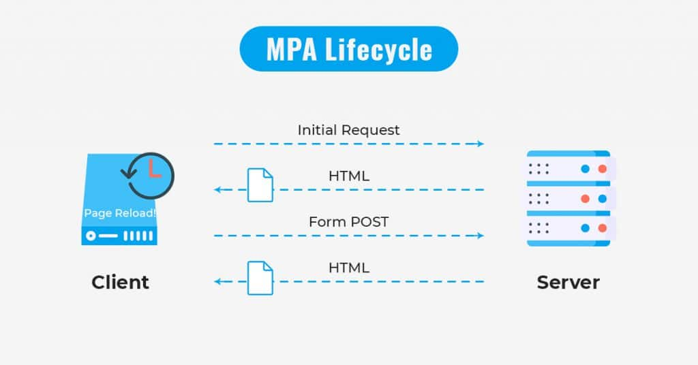
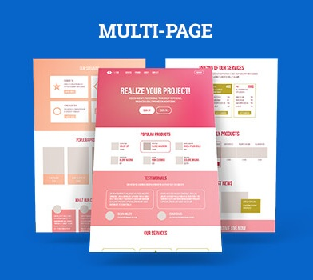

---
# You can also start simply with 'default'
theme: seriph
# random image from a curated Unsplash collection by Anthony
# like them? see https://unsplash.com/collections/94734566/slidev
layout: image
image: /assets/img/background.jpg
backgroundSize: cover
# some information about your slides (markdown enabled)
title: Discord bot és log program
# apply unocss classes to the current slide
class: text-center
# https://sli.dev/features/drawing
drawings:
  persist: false
# slide transition: https://sli.dev/guide/animations.html#slide-transitions
transition: slide-left
# enable MDC Syntax: https://sli.dev/features/mdc
mdc: true
---

<div class="mt-5">
  <h1 style="color: white">Naplózás discord bottal - Milyen technológiák szükségesek ehhez?</h1>
</div>

<div @click="$slidev.nav.next" class="mt-55 py-1" hover:bg="white op-10">
  Mi fán terem a bot, és egyáltalán... <carbon:arrow-right />
</div>

<div class="abs-br m-6 text-xl">
  <button @click="$slidev.nav.openInEditor" title="Open in Editor" class="slidev-icon-btn">
    <carbon:edit />
  </button>
  <a href="https://github.com/szankdav/SVSimulator-chatbot" target="_blank" class="slidev-icon-btn">
    <carbon:logo-github />
  </a>
</div>

---
transition: fade-out
---

## Mit fogunk ma tanulni?

<p v-click>Felhasznált technológiák:</p>

<ul>
  <li v-click>Discord bot</li>
  <li v-click>MVC (model-view-controller) programtervezési minta</li>
  <li v-click>SQLite3</li>
  <li v-click>MPA (multi page application)</li>
</ul>

<p v-click>Ma ezt a tudást szeretném veletek megosztani!</p>

<div class="flex">
<div @click="$slidev.nav.next" class="mt-15 py-1 text-center">
  <p v-click hover:bg="white op-10">Induljunk, csak nehogy megBOToljunk <carbon:arrow-right /></p>
  </div>
  </img>
</div>

---
transition: slide-up
---

<div>
  <h1 style="color: white">Mi a Discord</h1>
</div>


<ul>
  <li v-click>Szerverek és csatornák</li>
  <li v-click>Hang- és videóhívások</li>
  <li v-click>Botok és automatizáció</li>
  <li v-click>Integráció más alkalmazásokkal</li>
  <li v-click>Biztonsági és jogosultsági rendszer</li>
  <li v-click>Platformfüggetlenség</li>
</ul>

<p v-click>A Discord egy ingyenes, platformfüggetlen kommunikációs alkalmazás.</p>

<div v-click @click="$slidev.nav.next" class="mt-12 py-1 text-center" hover:bg="white op-10">
  Mik is azok a botok <carbon:arrow-right />
</div>

<style>
  .slidev-vclick-hidden {
  display: none;
}
</style>

---

</img>

<h2 v-click>Jellemzőik</h2>

<ul class="mt-5">
  <li v-click>Automatizáció</li>
  <li v-click>Interaktivitás</li>
  <li v-click>Moduláris felépítés</li>
  <li v-click>Könnyen konfigurálható</li>
  <li v-click>Biztonságos hozzáférés</li>
</ul>

<div v-click @click="$slidev.nav.next" class="mt-12 py-1 text-center" hover:bg="white op-10">
  Hogyan képes erre? <carbon:arrow-right />
</div>

<style>
  .slidev-vclick-hidden {
  display: none;
}
</style>

---



<div class="flex">
<div v-click @click="$slidev.nav.next" class="ml-65 py-1">
  <p hover:bg="white op-10">Nézzünk meg, hogyan jön létre egy bot <carbon:arrow-right /></p>
</div>
</div>

---

<div>
Egy egyszerű bot létrehozásának lépései Node.js és discord.js használatával:
</div>

<div class="mt-10" v-click>
```ts
import { Client, GatewayIntentBits } from "discord.js";
```
</div>
<div v-click>
```ts
const client = new Client({
  intents: [GatewayIntentBits.Guilds, GatewayIntentBits.GuildMessages],
});
```
</div>
<div v-click>
```ts
client.once("ready", () => {
  console.log(`Bot bejelentkezve: ${client.user?.tag}`);
});
```
</div>
<div v-click>
```ts
client.login("YOUR_DISCORD_BOT_TOKEN");
```
</div>

<div v-click @click="$slidev.nav.next" class="ml-90 mt-15 py-1">
  <p hover:bg="white op-10">Konfiguráljuk <carbon:arrow-right /></p>
</div>

---

<h2>A konfigurálás</h2>

<div class="mt-5" v-click>
Interakcióra történő feliratkozás:
```ts
client.on("interactionCreate", async (interaction) => {
  console.log(interaction);
});
```
</div>

<div class="mt-5" v-click>
Üzenetküldésre történő feliratkozás:
```ts
client.on("messageCreate", async (interaction) => {
  console.log(interaction);
});
```
</div>

<div class="mt-5" v-click>
Írjuk ki ki írta az üzenetet:
```ts
client.on("messageCreate", async (interaction) => {
  console.log(interaction.user.username);
});
```
</div>

<div v-click @click="$slidev.nav.next" class="ml-90 py-1">
  <p hover:bg="white op-10">A naplózás <carbon:arrow-right /></p>
</div>

---

<h2>A naplózó program</h2>

<ul class="mt-5">
  <li v-click>MVC programtervezési minta</li>
  <li v-click>SQLite3</li>
  <li v-click>MPA</li>
</ul>

<p class="mt-5"><span v-click>Bla-bla-bla-chit-chat</span><span v-click><carbon:arrow-right /></span><span v-click>Bot esemény kiváltása</span><span v-click><carbon:arrow-right /></span><span v-click>Üzenet mentése adatbázisba</span><span v-click><carbon:arrow-right /></span><span v-click>Üzenet megjelenítése böngészőben</span></p>

<p v-click>A programtervezési minták (design patterns) olyan újrafelhasználható megoldások, melyek gyakori problémákat oldanak meg. Nem konkrét kódot, implementációt kell érteni alatta, hanem egy útmutatót (paradigmát), mely az adott probléma megoldására kínál egy bejáratott megoldást. Forrás: <a href="https://mernokinformatikus.hu/tervezesi-mintak-a-gyakorlatban/" target="_blank">Tervezési minták</a></p>

<div v-click @click="$slidev.nav.next" class="ml-75 py-1">
  <p hover:bg="white op-10">Az MVC programtervezési minta<carbon:arrow-right /></p>
</div>

---

<h2>Model - View - Controller</h2>

<ul class="mt-5">
  <li v-click>Model (Adatkezelés)</li>
  <li v-click>View (Megjelenítés)</li>
  <li v-click>Controller (Vezérlés, logika)</li>
</ul>



<div v-click @click="$slidev.nav.next" class="ml-95 py-1">
  <p hover:bg="white op-10">Model<carbon:arrow-right /></p>
</div>

---

<h2>Model</h2>

<ul class="mt-5">
  <li v-click>Adatbázis műveletek (CRUD: Create, Read, Update, Delete)</li>
  <li v-click>Adatok érvényesítése, feldolgozása</li>
  <li v-click>A model mint típus definiálása</li>
</ul>

<div v-click>
<p>Példa egy model-re:</p>
```ts
export type AuthorModel = {
    id: number;
    name: string;
    createdAt: string;
};
```
```ts
export const createAuthor = async (db: Database, params: SqlParams): Promise<void> => {
    const sql: string = `INSERT INTO Authors(name, createdAt) VALUES (?, ?)`;
    try {
        await execute(db, sql, params);
    } catch (error) {
        logger.error("Error creating author:", error);
        throw new Error("Error creating author");
    }
};
```
</div>

---

<h2>View</h2>

<ul class="mt-5">
  <li v-click>Felhasználói interfész biztosítása</li>
  <li v-click>Az adatokat vizuálisan megjeleníti, de nem tartalmaz logikát</li>
</ul>

<div v-click>
<p>Példa egy view-ra:</p>

```html
<!DOCTYPE html>
<html lang="en">
<head>
    <title>Users List</title>
</head>
<body>
    <h1>Users</h1>
    <ul>
        <% users.forEach(user => { %>
            <li><%= user.username %> (<%= user.email %>)</li>
        <% }) %>
    </ul>
</body>
</html>
```
</div>

---

<h2>Controller</h2>

<ul class="mt-5">
  <li v-click>Kérések fogadása, feldolgozása és továbbítása a modellek felé</li>
  <li v-click>Adatok lekérése és megjelenítése a View-ban</li>
  <li v-click>Felhasználói interakciók kezelése</li>
</ul>

<div v-click>
<p>Példa egy controller-re:</p>
```ts
import { Request, Response } from "express";
import { User } from "../models/User";
export const getUsers = async (req: Request, res: Response) => {
    try {
        const users = await User.findAll();
        res.render("users", { users });
    } catch (error) {
        console.error("Error fetching users:", error);
        res.status(500).send("Internal Server Error");
    }
};
//index.ts
import { getUsers } from "../controllers/User";
app.get('/', getUsers);
```
</div>

<div v-click @click="$slidev.nav.next" class="text-center py-1">
  <p hover:bg="white op-10">Összegezzük<carbon:arrow-right /></p>
</div>

---

<h2>MVC</h2>

<ol class="mt-5">
  <li v-click>A felhasználó kérést küld (pl. egy gombra kattint)</li>
  <li v-click>A Controller fogadja a kérést, majd kéri az adatokat a Modelből</li>
  <li v-click>A Model lekérdezi az adatbázisból az adatokat és visszaküldi a Controllernek</li>
  <li v-click>A Controller átadja az adatokat a View-nak</li>
  <li v-click>A View megjeleníti az adatokat a felhasználónak</li>
</ol>

<p class="mt-5"><span v-click>User </span><span v-click><carbon:arrow-right /></span><span v-click>Controller </span><span v-click><carbon:arrow-right /></span><span v-click>Model </span><span v-click><carbon:arrow-right /></span><span v-click>Database </span><span v-click><carbon:arrow-right /></span><span v-click>Controller </span><span v-click><carbon:arrow-right /></span><span v-click>View (render)</span></p>

<p v-click>Előnyei</p>
<ul class="mt-5">
  <li v-click>Jobb szervezettség</li>
  <li v-click>Újrafelhasználhatóság</li>
  <li v-click>Tesztelhetőség</li>
  <li v-click>Párhuzamos fejlesztés</li>
</ul>

<div v-click @click="$slidev.nav.next" class="text-center py-1">
  <p hover:bg="white op-10">SQLite3<carbon:arrow-right /></p>
</div>

---

<h2>SQlite3</h2>

</img>

<ul class="mt-5">
  <li v-click>Szerver nélküli</li>
  <li v-click>Kis méretű és gyors</li>
  <li v-click>Egyszerű telepítés és használat</li>
  <li v-click>Platformfüggetlen</li>
  <li v-click>SQL-kompatibilitás</li>
</ul>

<p v-click>Mikor érdemes használni?</p>
<ul class="mt-5">
  <li v-click>Mobilalkalmazásokban</li>
  <li v-click>Asztali alkalmazásokban</li>
  <li v-click>Kis webes projektekben</li>
  <li v-click>Beágyazott rendszerekben</li>
  <li v-click>Ideiglenes adattárolásra és fejlesztésre</li>
</ul>


<div v-click @click="$slidev.nav.next" class="text-center py-1">
  <p hover:bg="white op-10">Nézzünk példát<carbon:arrow-right /></p>
</div>

<style>
  .slidev-vclick-hidden {
  display: none;
}
</style>

---

<h4>Egy egyszerű SQLite3 adatbázis létrehozása és használata TypeScript-ben</h4>

<div v-click>
```ts
import sqlite3 from 'sqlite3';
// Adatbázis inicializálása
const db = new sqlite3.Database('example.db');
// Tábla létrehozása
db.run(`CREATE TABLE IF NOT EXISTS users (
    id INTEGER PRIMARY KEY AUTOINCREMENT,
    name TEXT,
    email TEXT UNIQUE
)`);
// Adatok beszúrása
db.run(`INSERT INTO users (name, email) VALUES (?, ?)`, ['John Doe', 'john@example.com'], function(err) {
    if (err) {
        return console.error(err.message);
    }
    console.log(`User added with ID: ${this.lastID}`);
});
// Adatok lekérdezése
db.all(`SELECT * FROM users`, [], (err, rows) => {
    if (err) {
        throw err;
    }
    console.log(rows);
});
// Adatbázis bezárása
db.close();
```
</div>

---

<h2>SQlite3</h2>
</img>

<ol class="mt-5">
  <li v-click>✅Egyszerű</li>
  <li v-click>✅Gyors</li>
  <li v-click>✅Hatékony</li>
</ol>


<div v-click @click="$slidev.nav.next" class="text-center py-1">
  <p hover:bg="white op-10">MPA<carbon:arrow-right /></p>
</div>

---

<h2>Multi Page Application (MPA)</h2>

</img>

<ul class="mt-5">
  <li v-click>Minden oldal egy különálló HTML-fájl</li>
  <li v-click>Navigáció teljes oldalfrissítéssel</li>
  <li v-click>Klasszikus szerver-oldali renderelés</li>
  <li v-click>Jobb SEO-támogatás</li>
  <li v-click>Egyszerűbb szerveroldali logika</li>
  <li v-click>Kevesebb ügyféloldali JavaScript</li>
</ul>

<div v-click @click="$slidev.nav.next" class="text-center mt-20 py-1">
  <p hover:bg="white op-10">MPA vs. SPA<carbon:arrow-right /></p>
</div>

<style>
  .slidev-vclick-hidden {
  display: none;
}
</style>

---

<h2>MPA vs. SPA</h2>

<table>
<thead>
<tr>
<th>Tulajdonság</th>
<th>MPA (Multi Page Application)</th>
<th>SPA (Single Page Application)</th>
</tr>
</thead>
<tbody>
<tr>
<td v-click>Betöltés módja</td>
<td v-click>Minden új oldal teljesen betöltődik a szerverről</td>
<td v-click>Egyetlen HTML-fájl betöltődik, és dinamikusan frissül</td>
</tr>
<tr>
<td v-click>Sebesség</td>
<td v-click>Lassabb, mert minden oldalbetöltéskor új kérés történik</td>
<td v-click>Gyorsabb, mivel az oldal nem töltődik újra, csak az adat változik</td>
</tr>
<tr>
<td v-click>SEO támogatás</td>
<td v-click>Erős, mivel minden oldal egyedi URL-lel rendelkezik</td>
<td v-click>Nehezebb optimalizálni, de lehetséges SSR-rel</td>
</tr>
<tr>
<td v-click>Karbantarthatóság</td>
<td v-click>Könnyebb, ha sok oldal van és nincs szükség interaktív felhasználói élményre</td>
<td v-click>Jobb interaktív alkalmazásokhoz</td>
</tr>
<tr>
<td v-click>Technológia</td>
<td v-click>PHP, Laravel, Django, Spring Boot, ASP.NET</td>
<td v-click>React, Vue.js, Angular, Svelte</td>
</tr>

</tbody>
</table>

---

<h2>Mikor érdemes MPA-t használni?</h2>

<ul class="mt-5">
  <li v-click>Tartalomorientált weboldalaknál (pl. blogok, híroldalak)</li>
  <li v-click>Webshopoknál (pl. Amazon, eBay)</li>
  <li v-click>Adminisztrációs rendszereknél (pl. CMS rendszerek, vállalatirányítási rendszerek)</li>
  <li v-click>SEO-központú projektekben, ahol a keresőmotorok által könnyen indexelhető tartalom fontos</li>
</ul>

<p v-click>Hátrányok</p>
<ul class="mt-5">
  <li v-click>Lassabb oldalváltások</li>
  <li v-click>Nagyobb szerverterhelés, mert minden kérésnél újra kell generálni az oldalt.</li>
</ul>

<p v-click>Ha MPA-t (Multi Page Application) fejlesztünk, akkor egy template engine segíthet az oldalak dinamikus generálásában a szerveroldalon.</p>

<div v-click @click="$slidev.nav.next" class="text-center mt-5 py-1">
  <p hover:bg="white op-10">Template engine-ek<carbon:arrow-right /></p>
</div>

---

<h2>Mi az a Template Engine?</h2>

<ul>
  <li v-click>Az üzleti logika és a megjelenítés elválasztása</li>
  <li v-click>Dinamikus tartalom generálása (pl. adatbázisból beolvasott adatok megjelenítése)</li>
  <li v-click>Kód újrahasznosítása (pl. közös fejlécek, láblécek, navigációs sávok)</li>
</ul>

<p v-click>Hogyan működik:</p>
<p v-click>
```html
<h1>Üdv, <%= name %>!</h1>
<ul>
  <% users.forEach(user => { %>
    <li><%= user.name %></li>
  <% }) %>
</ul>
```
</p>
<p v-click>
```ts
app.get('/', (req, res) => {
    res.render('index', { name: "David", users: [{ name: "Anna" }, { name: "Peter" }] });
});
```
</p>

<p v-click>
```html
<h1>Üdv, David!</h1>
<ul>
  <li>Anna</li>
  <li>Peter</li>
</ul>
```
</p>

---

<h2 class="mb-5">Egyszerű MPA példa Express.js használatával</h2>

```ts
import express from 'express';
const app = express();
const port = 3000;

app.set('view engine', 'ejs');
app.use(express.static('public'));

app.get('/', (req, res) => {
    res.render('index', { title: 'Home' });
});

app.get('/about', (req, res) => {
    res.render('about', { title: 'About Us' });
});

app.get('/contact', (req, res) => {
    res.render('contact', { title: 'Contact' });
});

app.listen(port, () => {
    console.log(`Server running at http://localhost:${port}`);
});
```

---

<h2>Template Enginek</h2>

<ul class="mt-5">
  <li v-click>Node.js: EJS, Pug vagy Handlebars ajánlott.</li>
  <li v-click>PHP: Twig (Symfony) vagy Blade (Laravel) a legjobb választás.</li>
  <li v-click>Egyszerű, univerzális sablont: Mustache könnyen portolható más nyelvekre is.</li>
</ul>

<p v-click>Összegzés</p>
<ul class="mt-5">
  <li v-click>A template engine-ek segítenek dinamikusan generálni HTML-t egy sablon és egy adatobjektum alapján.</li>
  <li v-click>Használható szerveroldalon (MPA-khoz) és kliensoldalon (SPA-khoz) egyaránt.</li>
  <li v-click>MPA esetén EJS, Pug, Handlebars, Twig jó választás.</li>
  <li v-click>SPA esetén Vue, React JSX, Angular Templates használható.</li>
</ul>

<div v-click @click="$slidev.nav.next" class="text-center mt-5 py-1">
  <p hover:bg="white op-10">MPA összegzés<carbon:arrow-right /></p>
</div>

---

<h2>MPA összegezve</h2>

</img>

---

<h2>Mit tanultunk?</h2>

<ul class="mt-5">
  <li v-click>Discord bot</li>
  <li v-click>MVC (model-view-controller) programtervezési minta</li>
  <li v-click>SQLite3</li>
  <li v-click>MPA (multi page application)</li>
  <li v-click>SPA - SSR</li>
  <li v-click>Template engine</li>
</ul>

<p v-click>https://github.com/szankdav/SVSimulator-chatbot/tree/development</p>

<p v-click>https://discord-chatbot-svs.fly.dev/</p>

<h3 v-click class="text-center mt-20">Köszönöm, hogy velem tanultál!</h3>