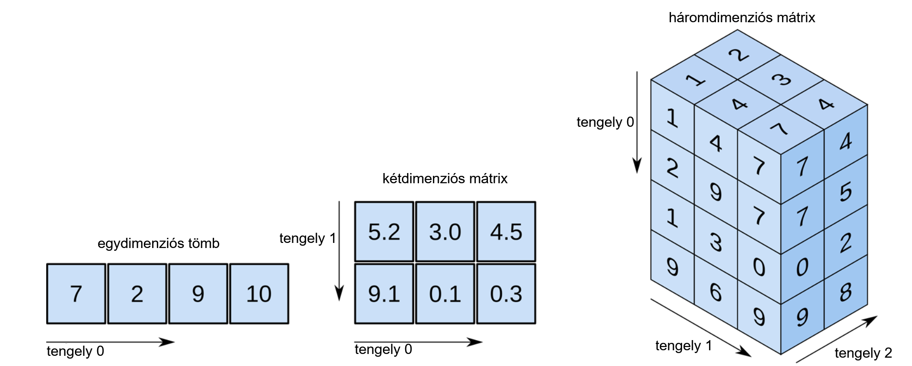
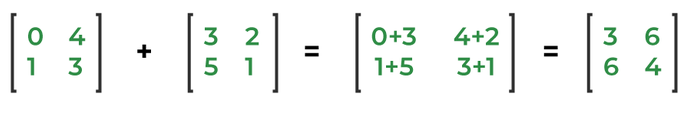
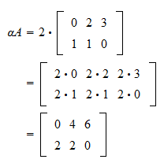
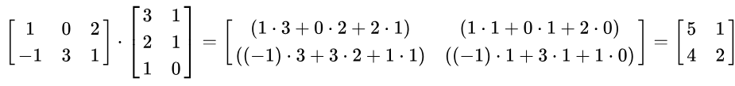

---
# You can also start simply with 'default'
theme: seriph
# random image from a curated Unsplash collection by Anthony
# like them? see https://unsplash.com/collections/94734566/slidev
background: "./img/math.jpg"
# some information about your slides (markdown enabled)
title: Mátrix szorzó program
# apply unocss classes to the current slide
class: text-center
# https://sli.dev/features/drawing
drawings:
  persist: false
# slide transition: https://sli.dev/guide/animations.html#slide-transitions
transition: fade-out
# enable MDC Syntax: https://sli.dev/features/mdc
mdc: true
---

# Mátrix szorzó program

## ...és ami mögötte van 

<div @click="$slidev.nav.next" class="mt-12 py-1" hover:bg="white op-10">
  Lássuk <carbon:arrow-right />
</div>

<div class="abs-br m-6 text-xl">
  <button @click="$slidev.nav.openInEditor" title="Open in Editor" class="slidev-icon-btn">
    <carbon:edit />
  </button>
  <a href="https://github.com/szankdav/matrix_szorzo_v2/tree/state-pattern" target="_blank" class="slidev-icon-btn">
    <carbon:logo-github />
  </a>
</div>

---
transition: fade-out
---

## A projekt célja

Ez a projekt tanulási céllal jött létre, melynek eredményeképp megismerkedhetünk a mátrixokkal, a velük végezhető műveletekkel, majd kiemelten ezek közül a szorzással. Ez után megnézzük mi az a State Pattern (állapot programtervezési minta), amit követtünk a program létrehozása során. Végül megtudjuk, hogyan tudjuk használni a programot.

</img>
<div @click="$slidev.nav.next" class="mt-12 py-1 text-center" hover:bg="white op-10">
  Ez jól hangzik! <carbon:arrow-right />
</div>

---
level: 2
---

## Mi a mátrix?
<br>
Definíció:<br> 

"A mátrix a matematikában mennyiségek téglalap alakú elrendezése (táblázata). (Számoké, függvényeké, kifejezéseké, vagy egyéb elemeké, esetleg más mátrixoké; általánosan valamilyen gyűrű vagy vektortér elemeié)."
<br>

Forrás: <a href="https://hu.wikipedia.org/wiki/M%C3%A1trix_(matematika)" target="_blank">Wikipédia</a>
<br>

Érthetőbben:<br>

A mátrix nem más, mint egy táblázat, mely sorokból és oszlopokból áll. Egy n * m mátrix n sorból és m oszlopból épül fel. Ezt kétdimenziós mátrixnak nevezzük. Létezik háromdimenziós mátrix is, ami több kétdimenziós mátrix gyűjteménye. Ebben az esetben egy sor oszlopának az eleme egy újabb kétdimenziós mátrix lesz, aminek szintén vannak sorai és oszlopai.


<div @click="$slidev.nav.next" class="mt-12 py-1 text-center" hover:bg="white op-10">
  Képpel érthetőbb lesz <carbon:arrow-right />
</div>

---

Programozás során a mátrixokat tömbök segítségével hozzuk létre. Egy kétdimenziós mátrix egy olyan tömb, amiben a sorok számának megfelelő számú tömbök kapnak helyet. Egy háromdimenziós mátrix pedig egy olyan tömb, ahol minden sor egy kétdimenziós mátrixot tartalmazó tömb:

</img>
<div @click="$slidev.nav.next" class="mt-8 text-center" hover:bg="white op-10">
  Műveletek mátrixokkal<carbon:arrow-right />
</div>

---
class: mt-8
---

## Műveletek mátrixokkal

Most, hogy már tudjuk mi a mátrix, ismerkedjünk meg a műveletekkel, amiket két, vagy több mátrix felhasználásával végre tudunk hajtani:

<ul>
<li>Transzponálás</li>
<li>Összeadás</li>
<li>Skalárral való szorzás</li>
<li>Mátrixszorzás</li>
</ul>

Mi a programunkban az utolsót, azaz a mátrixszorzást mutatjuk be. De mielőtt ráténénk erre, ismerkedjünk meg a három másik elvégezhető művelettel!

<div @click="$slidev.nav.next" class="mt-12 py-1 text-center" hover:bg="white op-10">
  Transzponálás<carbon:arrow-right />
</div>

---

## Transzponálás

Egy mátrix transzponálása sorainak és oszlopainak felcsérélését jelenti. Kétszer végrehajtva visszakapjuk az eredeti mátrixot. A transzponálás jele: A<sup>T</sup>

</img>

<div @click="$slidev.nav.next" class="mt-8 text-center" hover:bg="white op-10">
  Összeadás<carbon:arrow-right />
</div>

---
class: mt-12
---
## Összeadás

Csak azonos dimenziójú mátrixok adhatóak össze. Legyen A és B két azonos dimenziójú, n * m-es méretű mátrix. Az A+B összeget úgy képezzük, hogy az azonos helyen lévő elemeket összegezzük: 

<div class="text-center mb-15 mt-10">
(A+B)[i,j] = (A)[i,j] + (B)[i,j]

</img>
</div>

<div @click="$slidev.nav.next" class="mt-8 text-center" hover:bg="white op-10">
  Skalárral való szorzás<carbon:arrow-right />
</div>

---

## Skalárral való szorzás

Egy A mátrix a skalárral való aA szorzatát úgy számoljuk, hogy A minden elemét megszorozzuk "a" számmal:

<div class="text-center mb-8 mt-8">
(aA)[i,j] = a*(A)[i,j]

</img>
</div>

<div @click="$slidev.nav.next" class="text-center" hover:bg="white op-10">
  Mátrixszorzás<carbon:arrow-right />
</div>

---

## Mátrixszorzás

Két mátrix szorzata akkor definiált, ha a bal oldali mátrix oszlopainak száma megegyezik a jobb oldali mátrix sorainak számával. Ha A egy n * m-es, B pedig egy m * k-s mátrix, mátrixszorzatuk egy n * k méretű AB mátrix lesz, melynek elemei így számíthatóak:

<div class="text-center mb-8 mt-8">
(AB)[i,j] = A[i,1] * B[1, j] + A[i, 2] * B[2, j] + ... + A[i, n] * B[n, j] 

</img>
</div>

A programunkban a fent olvasható módszert alkalmazva vagyunk képesek két mátrix szorzását elvégezni.

Minden műveletről részletesen olvashatunk a <a href="https://hu.wikipedia.org/wiki/M%C3%A1trix_(matematika)" target="_blank">Wikipédián</a>!

<div @click="$slidev.nav.next" class="mt-12 text-center" hover:bg="white op-10">
  A program<carbon:arrow-right />
</div>

---

## Mátrix szorzó

Most, hogy már tudjuk mi a mátrix, és milyen műveletek milyen módon végezhetőek mátrixokon, ismerkedjünk meg a programmal, ami két mátrix szorzását végzi el nekünk!

A program forráskódja letölhető a GitHub-ról:<br>
https://github.com/szankdav/matrix_szorzo_v2/tree/state-pattern

A readme.md fájl tartalmazza a szükséges lépéseket és információkat a futtatáshoz!

A program egy konzolos alkalmazás, ami azt jelenti, hogy a felhasználó a terminál segítségével tud bevinni adatokat, és a megjelenítés is itt történik. 

A programkód írása során a State Pattern-t, vagyis az állapot programtervezési mintát követtük.

Mielőtt letöltenénk, és használnánk a programot, ismerkedjünk meg ezzel a programtervezési mintával.

<div @click="$slidev.nav.next" class="mt-15 text-center" hover:bg="white op-10">
  Design Patterns - Programtervezési minták<carbon:arrow-right />
</div>

---

## Patternek, avagy programtervezési minták

Azért itt álljunk meg egy pillanatra. Többször mondtuk már, hogy State Pattern. De egyáltalán mi az?

A State Pattern egyike a számos programtervezési mintának (design patterns). A programtervezési minták (design patterns) olyan újrafelhasználható megoldások, melyek gyakori problémákat oldanak meg. Nem konkrét kódot, implementiációt kell érteni alatta, hanem egy útmutatót (paradigmát), mely az adott probléma megoldására kínál egy bejáratott megoldást. Forrás: <a href="https://mernokinformatikus.hu/tervezesi-mintak-a-gyakorlatban/" target="_blank">Tervezési minták</a>

A mi programunkban célként tűztük ki, hogy miután megtörtént a mátrixok szorzása, a program ne álljon le, hanem a felhasználónak legyen lehetősége újabb szorzás végrehajtására, egészen addig, amíg azt nem mondja, hogy vége, ki szeretnék lépni.

Ahelyett, hogy saját módszert alkottunk volna erre, egy létező paradigmát hívtunk segítségül:<br>
A State Pattern-t.

Ezzel garantálhatjuk, hogy azok a fejlesztők, akik ismerik ezeket a koncepciókat, könnyebben el tudnak igazodni a kódunkban, és nem kell kitalálniuk, hogy "mire gondolt a költő". Akik pedig nem ismerik ezeket, azoknak itt az ideje megismerkedni velük! :)

<div @click="$slidev.nav.next" class="text-center" hover:bg="white op-10">
  State Pattern - Állapot programtervezési minta<carbon:arrow-right />
</div>

---

## State Pattern - Állapot programtervezési minta

A kitekintés után térjünk vissza az általunk használt programtervezési mintához, a State Pattner-höz.

Említettük, hogy a programunkat úgy szerettük volna megírni, hogy egészen addig fusson, amíg a felhasználó azt nem mondja, hogy ő ki szeretne lépni. Hogyan oldanánk ezt meg, ha nem a programtervezési mintákhoz fordulnánk segítségért? Szerintem sokatokban már most felmerült a válasz: sok-sok if-else, esetleg switch-case elágazással. Hiszen mindig ellenőriznünk kell, hogy a programunk éppen hol tart, mi történik éppen, és ez alapján kell a megfelelő irányba terelnünk a programunk futását.

A fő gondolat az, hogy egy adott pillanatban véges számú állapot van, amelyben a programunk lehet. Bármely egyedi állapoton belül a programunk másként viselkedik, és azonnal átkapcsolható egyik állapotból a másikba az if-else-ek segítségével.

Ez ahhoz fog vezetni, hogy a kódunk nagyon sok sorból fog állni, hiszen minden egyes lépés előtt ismét meg kell vizsgálnunk, hogy éppen mi történik, és ott helyben meg is kell mondanunk, hogy hogyan tovább. További állapotok implementálása növelni fogja az if-else elágazásunkat, a kód nehezen olvasható lesz, és a logika módosítása megváltoztathatja az if-else feltételeket, így karbantarthatóság szempontjából sem a legideálisabb ez a módszer.

<div @click="$slidev.nav.next" class="mt-5 text-center" hover:bg="white op-10">
  State Pattern - Állapot programtervezési minta<carbon:arrow-right />
</div>

---
class: mt-10
---
## State Pattern - Állapot programtervezési minta

Tehát, hogyan is segít nekünk a State Pattern (állapot programtervezési minta)?

Az állapot programtervezési minta szerint a legjobb, ha új osztályokat hozunk létre a programunk objektumainak összes lehetséges állapotához, és az összes állapotspecifikus viselkedést ezekben az osztályokban defíniáljuk. Ahelyett, hogy a viselkedéseket a program futtatására szolgáló fájlban valósítanánk meg, létrehozunk egy objektumot, amit kontextusnak nevezünk, ami eltárolja a hivatkozást az egyik állapotobjektumra, amely az aktuális állapotot reprezentálja, és az összes állapottal kapcsolatos munkát erre az állapotobjektumra delegálja.

Szóval, ahelyett, hogy a programunk aktuális állapotát if-else elágazások hadával felügyelnénk, állapotokat hozunk létre, és a programot mindig a megfelelő állapotban fogjuk futtatni.

<div @click="$slidev.nav.next" class="mt-10 text-center" hover:bg="white op-10">
  Nézzünk erre egy összehasonlító példát<carbon:arrow-right />
</div>

---
layout: two-cols 
class: mx-3  
---
```
class Document {
  constructor() {
    this.state = "DRAFT";
  }
  changeState(newState) {
    if (
      (this.state === "DRAFT" && newState === "REVIEW") ||
      (this.state === "REVIEW" && newState === "APPROVED") ||
      (this.state === "APPROVED" && newState === "PUBLISHED")
    ) {
      this.state = newState;
    } else {
      console.log(`Invalid state transition from ${this.state} to ${newState}`);
    }
  }
  getAvailableActions() {
    if (this.state === "DRAFT") {
      return ["Edit", "Submit for Review"];
    } else if (this.state === "REVIEW") {
      return ["Approve", "Request Changes"];
    } else if (this.state === "APPROVED") {
      return ["Publish"];
    } else if (this.state === "PUBLISHED") {
      return ["Archive"];
    }
  }
}
```
::right::

Ez az osztály egy dokumentum lehetséges állapotainak változtatására szolgál. 

A changeState metódus egy if-else elágazással ellenőrzi, hogy az aktuális állapot az átállítani kívánt állapotnak megfelelő-e. 

A getAvailableActions metódus pedig visszatér az aktuális állapot információival.

<div @click="$slidev.nav.next" class="mt-8 text-center" hover:bg="white op-10">
  Felhasználás<carbon:arrow-right />
</div>

---
layout: two-cols
class: mx-3
---

Láthatjuk, hogy a felhasználás során létrehozunk egy új objektumot, majd a lehetséges állapotok számának megfelelő mennyiségben meghívjuk az objektum metódusait.

Mi a gond ezzel?

Valójában semmi. Egészen addig, amíg csak ilyen kevés számú lehetséges állapot áll fenn. Azonban ha ki szeretnénk bővíteni az állapotok számát, az osztály mindkét funkcióját meg kell változtatunk az új állapotoknak megfelelően, majd a futáshoz szükséges kódot is ki kell bővítenünk, hiszen minden lehetséges állapotra meg kell hívnunk a changeState metódust.

Például ha szeretnénk egy "REJECTED" vagy egy "NOT APPROVED" állapotot, akkor ezt a két állapotot mindenhol bele kell írnunk a kódba, és a megfelelő helyen meg is kell hívnunk a changeState metódust a futás során.
::right::
```
const document = new Document();
console.log(document.state, document.getAvailableActions()); 

document.changeState("REVIEW");
console.log(document.state, document.getAvailableActions());

document.changeState("APPROVED");
console.log(document.state, document.getAvailableActions());

document.changeState("PUBLISHED");
console.log(document.state, document.getAvailableActions());
```

Érezhetjük, hogy ahogy növekszik a lehetséges állapotok száma, úgy lesz egyre nagyobb, átláthatatlanabb, nehezebben karbantartható a kódunk.

<div @click="$slidev.nav.next" class="mt-11 text-center" hover:bg="white op-10">
  Hogyan néz ki ugyan ez State Pattern felhasználásával<carbon:arrow-right />
</div>

---
layout: two-cols
class: mx-3
---

Hogyan néz ez ki State Pattern használata esetén?

Létrehozunk egy State interface-t, amiben definiáljuk az állapothoz szükséges funkciókat.

Majd létrehozunk egy "kontextus" osztályt. Ez lesz az osztályunk, aminek az állapota változni fog. Jelen esetben egy dokumentum az, aminek az állapotát szeretnénk változtatni a megfelelő módon.

Fontos, hogy kell lennie egy kezdőállapotnak, amit az osztály constructor-ban meg kell adnunk. 

A setState segítségével fogjuk az aktuális állapotot módosítani a paraméterben megadott állapotra.

<div @click="$slidev.nav.next" class="mt-11 text-center" hover:bg="white op-10">
  Állapot osztályok<carbon:arrow-right />
</div>
::right::
```
interface State {
  changeState(document, newState) {}
  getAvailableActions() {}
}
```
```
class Document {
  private state;

  constructor() {
    this.state = new DraftState();
  }

  setState(state) {
    this.state = state;
  }

  getState() {
    return this.state;
  }

  changeState(newState) {
    this.state.changeState(this, newState);
  }

  getAvailableActions() {
    return this.state.getAvailableActions();
  }
}
```

---
layout: two-cols
class: mx-3
---
Minden lehetséges állapothoz létrehozunk egy külön osztályt, ami a State Interface-t fogja implementálni, így megszabjuk, hogy minden állapot ugyanazokra a funkciókra legyen képes. Itt a Draft állapot osztálya látható. Figyeljük meg, hogy a changeState a document osztály egy példányát fogja paraméterként megkapni, majd a példány setState metódusának segítségével átállítja a kontextus osztályunk aktuális állapotát egy új ReviewState állapotra. 

Mivel ezt minden állapot osztályában ugyan így fogjuk definiálni, a megfelelő következő állapot beállításával biztosítjuk, hogy a programunk mindig a megfelelő állapotba kerüljön. Nem szükséges if-else, switch-case, nem kell ellenőriznünk, hogy éppen melyik állapotban vagyunk, mert minden állapot csak a megfelelő állapot után állhat be ezzel a módszerrel.
::right::

```
class DraftState implements State {
  changeState(document, newState) {
    if (newState === "REVIEW") {
      document.setState(new ReviewState());
    } else {
      console.log(`Invalid transition from DRAFT to ${newState}`);
    }
  }

  getAvailableActions() {
    return ["Edit", "Submit for Review"];
  }
}
```
<div @click="$slidev.nav.next" class="mt-20 text-center" hover:bg="white op-10">
  Felhasználás<carbon:arrow-right />
</div>

---
layout: two-cols
class: mx-3
---

Több módszer létezik a felhasználásra, de mivel mi azt szerettük volna elérni, hogy a program addig fusson, míg a felhasználó le nem állítja, ezt a módszert fogom bemutatni a fent látott kódhoz is.
Mondjuk azt, hogy ez a program addig fusson, amíg a dokumentum nem kerül APPROVED állapotba. Ha elérjük ezt az állapotot, akkor érjen véget a program.

Ami itt történik:
Létrehozunk egy új Document példányt, ami a constructor-nak köszönhetően be fogja állítani a kezdő állapotot. A changeState segítségével megadjuk, hogy mi legyen a következő állapot, aminek az átváltását elvégzi a kezdő állapotunk, vagyis a DraftState. Mivel minden állapotot kapott saját osztályt, megfelelően végigvezetve az állapotváltásokat, eljutunk az ApprovedState osztályig, aminek hatására az osztály logikája miatt a programunk bezárul.

::right::

```
const document = new Document();
do{
  document.changeState("REVIEW");
}while(true)
```

Ha a későbbiekben bővítenünk kell az állapotokat, akkor minden új állapotnak létrehozunk egy új osztályt, és beillesszük őket a láncba a megfelelő helyre, valamint megadjuk, hogy mi következzen az új állapot után. Majd ismét el fogunk jutni a program végére. Nem szükséges a teljes if-else elágazást módosítani, nem kell a futás során egy új sorban ismét meghívni az állapotot.

<a href="https://refactoring.guru/design-patterns/state" target="_blank">Bővebben a State Pattern-ről</a>
<div @click="$slidev.nav.next" class="mt-15 text-center" hover:bg="white op-10">
  Próbáljuk ki!<carbon:arrow-right />
</div>
---

Most, hogy megismerkedtünk a mátrixokkal, tudjuk mi az a State Pattern, illetve, hogy általában mik azok a pattern-ök, itt az ideje, hogy gyakorlatban is kipróbáljuk a tanultakat!

Töltsük le a programot, és használjuk, nézzük át a kódot és a hozzá tartozó dokumentációt, és értelmezzük! Gondoljunk bele, hogy hogyan tudtuk volna ezt elkészíteni State Pattern felhasználása nélkül!

A program forráskódja letölhető a GitHub-ról:<br>
https://github.com/szankdav/matrix_szorzo_v2/tree/state-pattern

A readme.md fájl tartalmazza a szükséges lépéseket és információkat a futtatáshoz!

A program részletes dokumentációja a docs mappában elérhető!

<div class="mt-20">
Köszönöm, hogy velem tanultál!
</div>